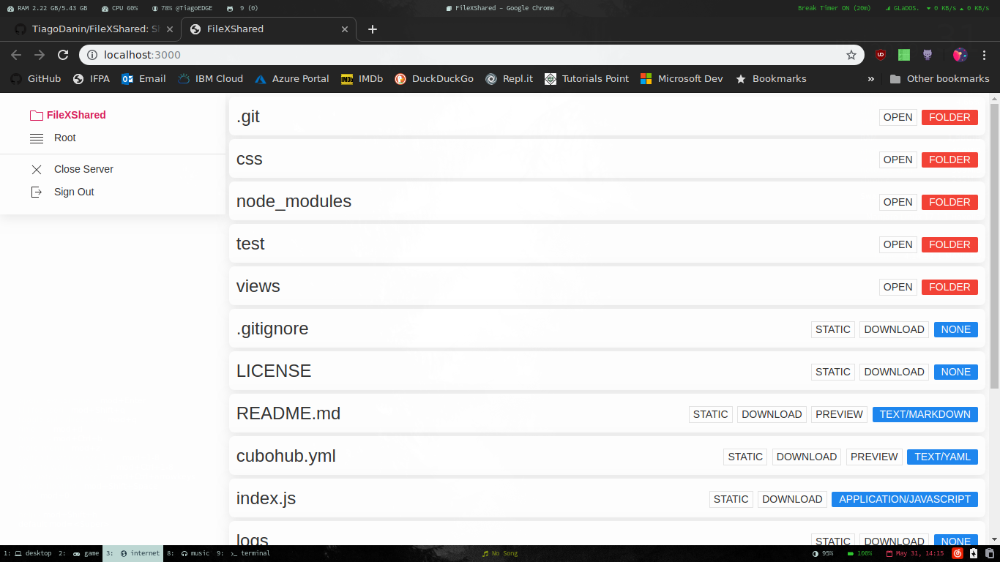

# FileXShared

[](https://npmjs.org/package/filexshared) [](https://npmjs.org/package/filexshared) 

Share files Fast, Easy and Secure, to world or on your local network.



## Installation

Module available through the [npm registry](https://www.npmjs.com/). It can be installed using the  [`npm`](https://docs.npmjs.com/getting-started/installing-npm-packages-locally) or [`yarn`](https://yarnpkg.com/en/) command line tools.

```sh
# NPM
npm install filexshared --global
# Or Using Yarn
yarn global add filexshared
```

## Usage

```sh
# Start
fileXShared

# Start (with dark theme)
filexshared --dark

# Start (enable password)
filexshared --password=1234567890

# Start (without "Close Server" option)
filexshared --disable-close
```

## Dependencies

- [cookie-session](https://ghub.io/cookie-session): cookie session middleware
- [express](https://ghub.io/express): Fast, unopinionated, minimalist web framework
- [express-handlebars](https://ghub.io/express-handlebars): A Handlebars view engine for Express which doesn&#x27;t suck.
- [filenamify](https://ghub.io/filenamify): Convert a string to a valid safe filename
- [hubdown](https://ghub.io/hubdown): Convert markdown to GitHub-style HTML using a common set of remark plugins
- [mime](https://ghub.io/mime): A comprehensive library for mime-type mapping
- [minimist](https://ghub.io/minimist): parse argument options
- [multer](https://ghub.io/multer): Middleware for handling &#x60;multipart/form-data&#x60;.
- [uikit](https://ghub.io/uikit): UIkit is a lightweight and modular front-end framework for developing fast and powerful web interfaces.

## Contributors

Pull requests and stars are always welcome. For bugs and feature requests, please [create an issue](https://github.com/TiagoDanin/FileXShared/issues). [List of all contributors](https://github.com/TiagoDanin/FileXShared/graphs/contributors).

## License

[MIT](LICENSE) © [Tiago Danin](https://TiagoDanin.github.io)